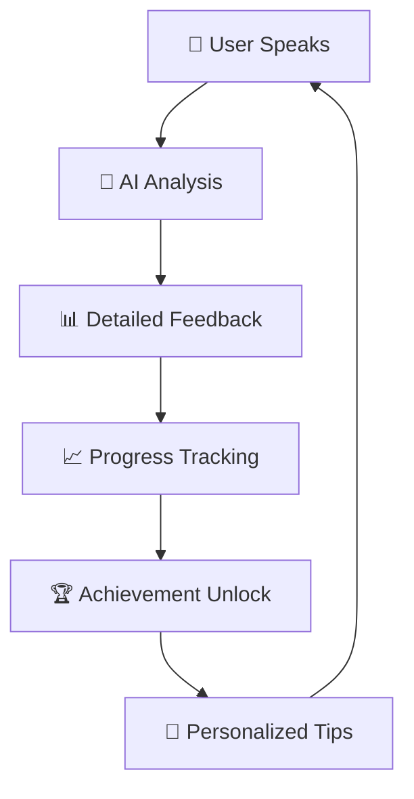

# 🎯 Grader.AI - IELTS Speaking Assistant

<div align="center">


**Your Personal IELTS Speaking Coach Powered by AI** 🤖✨

[](https://flutter.dev/)
[](https://firebase.google.com/)
[](https://openai.com/)
[](LICENSE)

</div>

---

## 🌟 What is Grader.AI?

Grader.AI is a revolutionary **IELTS Speaking preparation app** that uses advanced AI to provide personalized feedback, practice sessions, and progress tracking. Whether you're aiming for Band 6 or Band 9, our AI coach will help you achieve your goals! 🎯

### 🚀 Key Features

| Feature | Description | Status |
|---------|-------------|--------|
| 🎤 **AI-Powered Speaking Practice** | Real-time speech analysis with detailed feedback | ✅ Active |
| 📊 **Progress Tracking** | Weekly progress charts and achievement system | ✅ Active |
| 🏆 **Achievement System** | Unlock badges as you improve | ✅ Active |
| 📱 **Cross-Platform** | iOS, Android, macOS, Windows support | ✅ Active |
| 🔥 **Firebase Integration** | Real-time data sync and user management | ✅ Active |
| 💳 **In-App Purchases** | Premium features and subscription plans | ✅ Active |
| 🎨 **Beautiful UI** | Modern, professional design with animations | ✅ Active |

---

## 🎮 How It Works



### 📱 User Journey

1. **🎯 Set Your Target Band** - Choose your IELTS goal (6.0 to 9.0)
2. **🎤 Practice Speaking** - Answer AI-generated questions
3. **📊 Get Instant Feedback** - Receive detailed analysis on:
   - **Fluency & Coherence** - Speaking smoothly and logically
   - **Lexical Resource** - Vocabulary usage and variety
   - **Grammar** - Sentence structure and accuracy
   - **Pronunciation** - Clarity and intonation
4. **📈 Track Progress** - Monitor your improvement over time
5. **🏆 Unlock Achievements** - Earn badges for milestones
6. **🎯 Get Personalized Tips** - AI-powered recommendations

---

## 🛠️ Tech Stack

### Frontend
- **Flutter** - Cross-platform mobile development
- **Dart** - Programming language
- **ScreenUtil** - Responsive design
- **GetX** - State management

### Backend & Services
- **Firebase** - Authentication, Firestore, Analytics
- **OpenAI GPT-4** - AI analysis and feedback
- **Google Play Billing** - Android in-app purchases
- **Apple In-App Purchase** - iOS subscriptions

### Design & UI
- **Custom Design System** - Consistent UI components
- **Glassmorphism** - Modern visual effects
- **Animations** - Smooth user interactions
- **Responsive Layout** - Works on all screen sizes

---

## 🚀 Getting Started

### Prerequisites

- **Flutter SDK** (3.0.0 or higher)
- **Dart SDK** (2.17.0 or higher)
- **Firebase CLI** (for configuration)
- **Xcode** (for iOS development)
- **Android Studio** (for Android development)

### 📦 Installation

1. **Clone the repository**
   ```bash
   git clone https://github.com/Danchouvzv/Grader.git
   cd grader_ai_flutter
   ```

2. **Install dependencies**
   ```bash
   flutter pub get
   ```

3. **Configure Firebase**
   ```bash
   # Add your Firebase configuration files:
   # - android/app/google-services.json
   # - ios/Runner/GoogleService-Info.plist
   # - macos/Runner/GoogleService-Info.plist
   ```

4. **Set up API Keys**
   ```bash
   # Create .env file with your API keys:
   OPENAI_API_KEY=your_openai_api_key_here
   ```

5. **Run the app**
   ```bash
   flutter run
   ```

### 🔧 Configuration

#### Firebase Setup
1. Create a new Firebase project
2. Enable Authentication, Firestore, and Analytics
3. Download configuration files to respective directories
4. Update `firebase_options.dart` with your project settings

#### OpenAI Setup
1. Get your API key from [OpenAI Platform](https://platform.openai.com/)
2. Add it to your `.env` file
3. The app will automatically use it for AI analysis

---

## 📱 App Structure

```
lib/
├── 🎯 core/                    # Core business logic
│   ├── models/                # Data models
│   ├── services/              # Business services
│   └── controllers/           # State management
├── 🎨 presentation/            # UI layer
│   ├── pages/                 # App screens
│   ├── widgets/               # Reusable components
│   └── themes/                # Design system
├── 🔥 features/               # Feature modules
│   └── ielts/                 # IELTS-specific features
└── 🛠️ shared/                # Shared utilities
    ├── themes/                # Design system
    └── widgets/               # Common widgets
```

---

## 🎨 Design System

Our app uses a **centralized design system** for consistent UI:

### 🎨 Color Palette
- **Primary Blue** - `#3B82F6` (Trust, Professional)
- **Accent Red** - `#F43F5E` (Energy, Action)
- **Success Green** - `#10B981` (Progress, Achievement)
- **Background** - `#FFFFFF` (Clean, Minimal)

### 📐 Spacing Scale
- **4px** - Micro spacing
- **8px** - Small spacing
- **16px** - Medium spacing
- **24px** - Large spacing
- **32px** - Extra large spacing

### 🔤 Typography
- **Headlines** - Bold, impactful
- **Body Text** - Readable, comfortable
- **Captions** - Subtle, informative

---

## 🔥 Features Deep Dive

### 🎤 AI Speaking Analysis

Our AI analyzes your speech across four key IELTS criteria:

```dart
// Example feedback structure
{
  "fluency_coherence": 7.5,
  "lexical_resource": 6.8,
  "grammar": 7.2,
  "pronunciation": 6.9,
  "overall_band": 7.1,
  "detailed_feedback": "Great job! Your fluency is excellent...",
  "improvement_tips": ["Work on vocabulary variety", "Practice complex sentences"]
}
```

### 📊 Progress Tracking

- **Weekly Progress Charts** - Visual representation of improvement
- **Session History** - Track all your practice sessions
- **Band Score Trends** - See your progress over time
- **Weak Area Identification** - AI identifies areas for improvement

### 🏆 Achievement System

Unlock achievements as you progress:
- 🎯 **First Steps** - Complete your first session
- 🔥 **Streak Master** - Practice for 7 days straight
- 📈 **Improvement** - Increase your band score
- 🎖️ **Perfectionist** - Achieve Band 9.0

---

## 💳 Subscription Plans

| Plan | Price | Features |
|------|-------|----------|
| **Free** | $0 | Basic practice sessions, Limited feedback |
| **Premium Monthly** | $9.99 | Unlimited sessions, Detailed AI analysis, Progress tracking |
| **Premium Yearly** | $79.99 | All Premium features + Priority support |
| **Lifetime** | $199.99 | One-time payment, Lifetime access |

---

## 🧪 Testing

### Running Tests
```bash
# Unit tests
flutter test

# Integration tests
flutter test integration_test/

# Coverage report
flutter test --coverage
```

### Test Coverage
- **Unit Tests** - Core business logic
- **Widget Tests** - UI components
- **Integration Tests** - End-to-end flows

---

## 📦 Building for Production

### Android
```bash
flutter build apk --release
flutter build appbundle --release
```

### iOS
```bash
flutter build ios --release
```

### macOS
```bash
flutter build macos --release
```

### Windows
```bash
flutter build windows --release
```

---

## 🚀 Deployment

### Google Play Store
1. Build release APK/AAB
2. Upload to Play Console
3. Configure store listing
4. Submit for review

### Apple App Store
1. Build iOS app
2. Upload to App Store Connect
3. Configure app information
4. Submit for review

---

## 🤝 Contributing

We welcome contributions! Here's how you can help:

### 🐛 Bug Reports
- Use GitHub Issues
- Provide detailed reproduction steps
- Include device/OS information

### 💡 Feature Requests
- Describe the feature clearly
- Explain the use case
- Consider implementation complexity

### 🔧 Code Contributions
1. Fork the repository
2. Create a feature branch
3. Make your changes
4. Add tests if applicable
5. Submit a pull request

### 📝 Code Style
- Follow Dart/Flutter conventions
- Use meaningful variable names
- Add comments for complex logic
- Write tests for new features

---

## 📄 License

This project is licensed under the **MIT License** - see the [LICENSE](LICENSE) file for details.

---

## 🙏 Acknowledgments

- **OpenAI** - For providing the AI analysis capabilities
- **Firebase** - For backend services and real-time sync
- **Flutter Team** - For the amazing cross-platform framework
- **IELTS** - For the comprehensive speaking assessment criteria

---

## 📞 Support

Need help? We're here for you!

- 📧 **Email** - support@graderai.com
- 💬 **Discord** - [Join our community](https://discord.gg/graderai)
- 📱 **In-App** - Use the feedback form
- 🐛 **Issues** - [GitHub Issues](https://github.com/Danchouvzv/Grader/issues)

---

## 🌟 Star History

[](https://star-history.com/#Danchouvzv/Grader&Date)

---

<div align="center">

**Made with ❤️ by the Grader.AI Team**

[](https://github.com/Danchouvzv/Grader)
[](https://twitter.com/graderai)
[](https://linkedin.com/company/graderai)

</div>